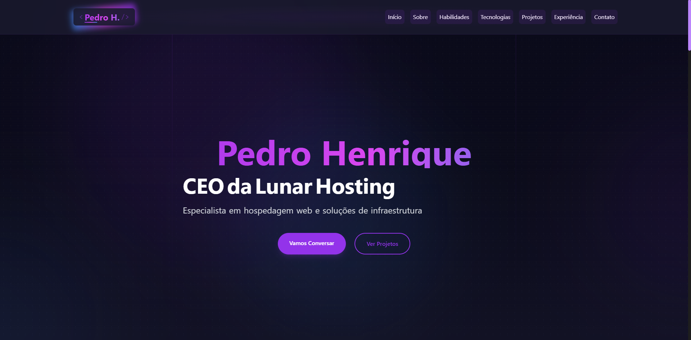

# Portfólio Pessoal - Pedro Henrique

Um portfólio moderno e interativo desenvolvido com Next.js, TailwindCSS e Framer Motion.

## 🚀 Tecnologias

- [Next.js 14](https://nextjs.org/)
- [React](https://reactjs.org/)
- [TypeScript](https://www.typescriptlang.org/)
- [Tailwind CSS](https://tailwindcss.com/)
- [Framer Motion](https://www.framer.com/motion/)
- [React Icons](https://react-icons.github.io/react-icons/)

## 📁 Estrutura do Projeto

### App (`/app`)

- `layout.tsx` - Layout principal da aplicação
- `page.tsx` - Página inicial com todas as seções
- `not-found.tsx` - Página 404 personalizada
- `globals.css` - Estilos globais
- `/api/contact` - API route para o formulário de contato

### Componentes (`/components`)

#### Principais
- `Header.tsx` - Navegação principal com menu responsivo
- `Footer.tsx` - Rodapé com links e informações de contato
- `AnimatedBackground.tsx` - Background interativo com efeitos
- `ProjectCard.tsx` - Card para exibição de projetos

#### Seções
- `Certifications.tsx` - Exibe certificações
- `ContactForm.tsx` - Formulário de contato
- `ExperienceTimeline.tsx` - Timeline de experiência profissional
- `Technologies.tsx` - Grid de tecnologias utilizadas
- `Testimonials.tsx` - Seção de depoimentos
- `Stats.tsx` - Estatísticas e números

#### Utilitários
- `AnimatedText.tsx` - Componente para animação de texto
- `CV.tsx` - Componente para download do currículo
- `LoadingSpinner.tsx` - Spinner de carregamento
- `MobileMenu.tsx` - Menu mobile responsivo
- `ScrollToTop.tsx` - Botão para voltar ao topo
- `SkillCard.tsx` - Card para exibição de habilidades

## 🌟 Features

- ✨ Animações suaves com Framer Motion
- 📱 Design totalmente responsivo
- 🌙 Tema dark moderno
- 📧 Formulário de contato funcional
- 📄 Download de CV
- 🎨 Backgrounds animados
- ⚡ Performance otimizada
- 🔍 SEO otimizado

## 📝 Licença

Este projeto está sob a licença MIT. Veja o arquivo [LICENSE](LICENSE) para mais detalhes.

## 👤 Autor

**Pedro Henrique**

* Website: [lunarhosting.com.br](https://lunarhosting.com.br)
* Github: [@pedrortxdev](https://github.com/pedrortxdev)

## 🤝 Contribuindo

Contribuições, issues e feature requests são bem-vindas!

1. Faça o Fork do projeto
2. Crie sua Feature Branch (`git checkout -b feature/AmazingFeature`)
3. Commit suas mudanças (`git commit -m 'Add some AmazingFeature'`)
4. Push para a Branch (`git push origin feature/AmazingFeature`)
5. Abra um Pull Request

---
⭐️ From [pedrortxdev](https://github.com/pedrortxdev)
